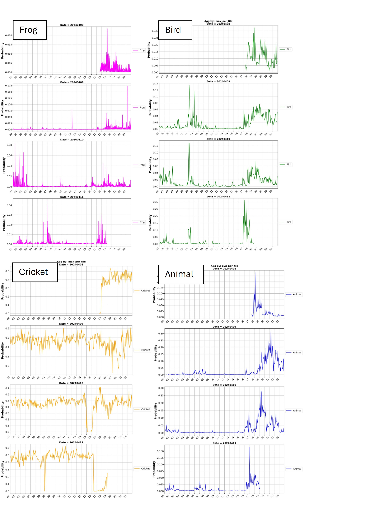
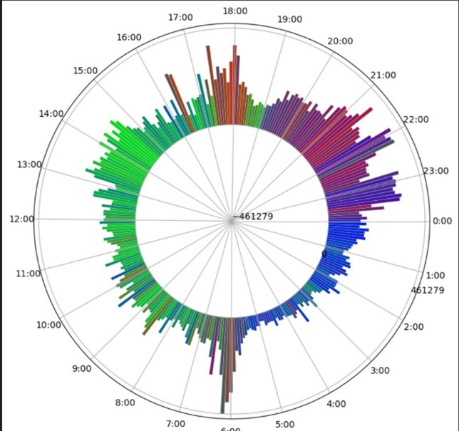

# circadian_soundscape
This readme file was created by Confused_scientists for the AI+Environment Hackathon 2024

# GENERAL INFORMATION
Title of project: Analysing the Circadian Rhythm of the Amazon soundscape
Team: Confused_scientists

Name: Nivedita Varma Harisena \
Institution: ETH Zurich \
Email: nharisena@ethz.ch

Name: Leon Hauser \
Institution: University of Zurich \
Email: leon.hauser@geo.uzh.ch

Name: Varun Ghat Ravikumar \
Institution: University of Zurich \
Email: varunghat.ravikumar@uzh.ch

Name: Kien Nguyen \
Institution: University of Zurich \
Email: kien.nguyen@geo.uzh.ch

# INTRODUCTION
The following readme includes information on the data and code files submitted as part of the Hackathon. We also include code outputs for 3 sites in the Amazon as mentioned in the sampling_sites excel. The data we used for this as an example was downloaded from the google drive shared folders: Dataset/Audio/Ingles/Primary1-including ultrasonic; Dataset/Audio/Inha-be/ Inha-be Audiomoth; Dataset/Audio/ParqueDasTribos
The code can be used for all .wav file inputs retrieved from AudioMoth.
	
# DATA & FILE OVERVIEW
## Code files
1.	“AST_demo.ipynb” and "AST_run.py"- Includes implementation of an AST classification algorithm for classification of .wav files into 'speech','bird','frog','cricket' and 'animal' species. Please use the 'AST_run.py' to implement the alogrithm for batch implementation across multiple audio files denoting a soundscape. 
2.	"AudioCLIP" folder includes implementation of AudioCLIP classification of species acoustic signals
3.	“powerminusnoise.R”- Includes the implementation of “Power minus Noise” (PMN) index estimations that is a proxy for acoustic activity within a frequency range. The code outputs a .csv for each .wav input.
4.	“renametoadjustGMToff”- If input time steps are in GMT, this changes the file names to offset the output to the correct local time. 
5.	“Post-processing2_linepy”-Aggregates the outputs from “powerminusnoise.R” to get average, median and max values per time step in 24 hours for multiple days.
6.	“Plot_classification_result.ipynb”- Creates Line plots with time (24 hrs) in the x axis and species classification probabilities in the y axis for a given list of species.
7.	“Graph_PMN.ipynb”- Creates line plots with time in the x axis and PowerminusNoise estimates in the y axis for given frequency bins that can refer to the acoustic niche of different species. Also includes code to visualize the ‘colour’ of PMN over time by converting 3 chosen frequency bins to an RGB equivalent, allowing us to identify via colour which species group is most active in which time of the day based on the colour profiles.
8.	"get_pmn_aggregated.py" - Creates aggregated csv files for PMN values coming from the powerminusnoise.R code. Computes average, max and median PMN for each frequency bin and gets the data ready to be visualized by the hugging face space"

## Data files
We also provide intermediate output from the 3 sites mentioned above. For each site you can find:
1.	Output from AST classification in “results\ASTresults.zip" and for audioCLIP in "results\results_AudioCLIP.zip" in the form of .csv files.
2.	Output for average, max and median PMN values in "results\pmn_timeadjusted_sitename.zip". The .csv files in this folder can be uploaded to our hugging face space to generate certain visualisations. 

### Relationship between files, if important: 
The output from “AST_run.py” can be fed into “graph_classification.py” to get graphs of daily patterns of acoustic activity probabilities as predicted by the AST for crickets, frogs, animal, birds and human sounds.
The output from “powerminusnoise.R” must be fed into “Post-processing2_line.py” to get Output 2 as mentioned above. This should then be processed with “renametoadjustGMToff.py” and the output from which can be used in “Graph_PMN.ipynb” to create visualisations. Examples of this is included later in this readme file. 

# Example visualisation output

1.	Graphs from AST classification:  

2.	Graphs from PowerminusNoise estimates:

Image shows PMN estimates visualised as RGB composites for 3 frequency bins i.e. Red: 0-1500 Hz (denoting acoustic activity in the lower ranges i.e. certain birds, mammals and possible human activity); Green: 1500-5000 Hz (denoting bird activity) and Blue: 5000-10000 Hz (denoting insects).

All graphs generated from AST classification be found in '/figure' folder. PMN graphs like the ones generated above (and more) can be created using the "Graph_PMN.ipynb" script. 
Additionally, visualization of the output has also been implemented via our Huggingface interface: https://huggingface.co/spaces/confused-scientists/circadian_soundscape
